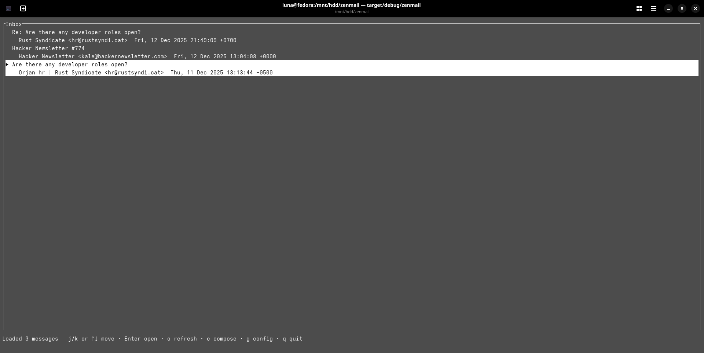
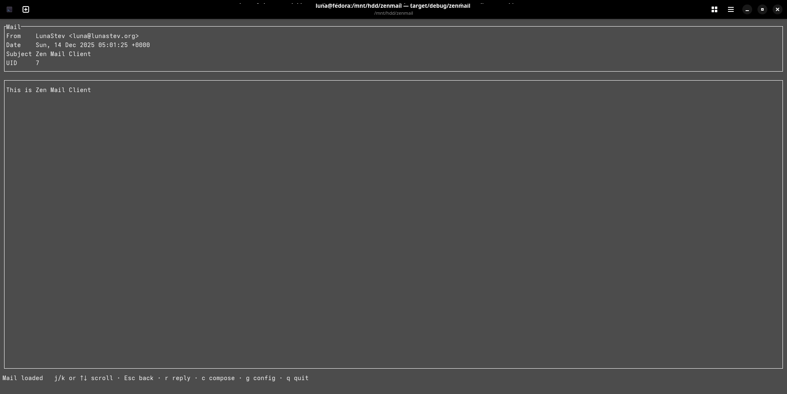

# Zen Mail Client

**Zen Mail Client** is a minimal TUI mail client for people who still use email to talk to humans.

It focuses on reading and replying to plain text emails over standard **IMAP / SMTP**, without HTML rendering, trackers, or unnecessary complexity.

---





---

## Installation

Currently, zenmail is cargo.

```bash
cargo install zenmail
```

---

## Why Zen Mail Client?

Modern email clients are optimized for newsletters, notifications, and marketing emails.  
zenmail is not.

zenmail is designed for:
- personal contact emails
- project and open-source communication
- patches, reviews, and real conversations

If you want a fast, reliable mail client that lives in your terminal and does not get in your way, Zen Mail is for you.

---

## Features

- IMAP inbox listing
- Read plain text (`text/plain`) emails
- Scrollable mail view
- Compose and send emails via SMTP
- One-key **Reply**
    - Auto-fill recipient
    - `Re:` subject handling
    - Quoted reply (`>`)
- Built-in TUI config editor
- External editor support for `config.toml`
- Robust terminal handling (resize-safe, editor-safe)

---

## Non-Features (by design)

zenmail intentionally does **not** support:

- HTML email rendering
- Embedded images
- Tracking pixels
- OAuth-only providers
- Rich formatting

This keeps the client predictable, fast, and secure.

---

## Supported Mail Servers

zenmail works with any standard IMAP / SMTP server.

It is tested with **Proton Mail Bridge**, using:

- IMAP / SMTP over localhost
- Username + password authentication
- STARTTLS

---

## Key Bindings

### Inbox
- `j` / `k` or `↑` / `↓` — move selection
- `Enter` — open mail
- `o` — refresh inbox
- `c` — compose new mail
- `q` — quit

### Mail View
- `j` / `k` or `↑` / `↓` — scroll
- `r` — reply
- `c` — compose new mail
- `Esc` — back to inbox

### Compose
- `Tab` — switch field
- `Ctrl+S` — send
- `Esc` — cancel

### Config
- `Tab` / `Shift+Tab` — move field
- `Space` — toggle boolean
- `Ctrl+S` — save
- `e` — open in external editor
- `Esc` — back

---

## Configuration

On first launch, zenmail creates a `config.toml` file.

You can edit it:
- directly in the built-in TUI config screen
- or using your `$EDITOR` (default: `nano`)

---

## License

Licensed under the [MPL-2.0](LICENSE) license.

Copyright © Wave Foundation.